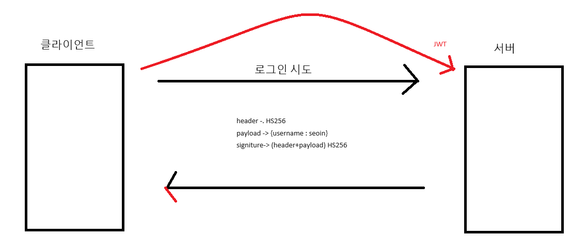

# SpringSecurity

## 목차
1. [Spring Security](#1-spring-security)
2. [OAuth](#2-oauth)
3. [JWT](#3-JWT)


### 1. Spring Security

1. @Configuration
  - 해당 클래스를 스프링의 설정 클래스로 지정하는 역할
  - 스프링 컨테이너가 해당 클래스를 컨포넌트 스캔하고 빈으로 등

<br>

2. View Resolver
   - 스프링 MVC에서 View를 찾아주는 역할
   - 클라이언트의 요청에 대한 응답으로 뷰를 생성하기 위해 컨트롤러에서 반환한 뷰 이름을 실제 뷰 객체로 변환하는 작업을 함

<br>

3. WebMvcConfigurer
   - Spring MVC 구성을 사용자가 직접적으로 변경하고 구성할 수 있게 해주는 인터페이즈
   - View Resolver 및 Handler Mapping 등록
   - Resource Handler 등록
   - Intercepter 등록
   - Message Converter 등록
   - View Controller 등록

<br> 

4. void configureViewREsolers
   - SPring MVC에서 View Resolver를 설정하는 메서드
   - ViewResolverRegistery 객체를 사용하여 다양한 유형의 View Resolver를 추가하고 구성할 수 있

<br> 

5. @Override configureViewResolvers

   
<details>
<summary>자세히</summary>

  public void configureViewResolvers(ViewResolverRegistry registry) {
  
    // MustacheViewResolver 객체 생성
    MustacheViewResolver resolver = new MustacheViewResolver();
    
    // 문자 인코딩 설정
    resolver.setCharset("UTF-8");
    
    // 컨텐츠 타입 설정
    resolver.setContentType("text/html;charset=UTF-8");
    
    // 뷰 파일의 위치(prefix) 설정
    resolver.setPrefix("classpath:/templates/");
    
    // 뷰 파일의 확장자(suffix) 설정
    resolver.setSuffix(".html");
    
    // 설정한 MustacheViewResolver를 뷰 리졸버 레지스트리에 등록
    registry.viewResolver(resolver);
}

</details>

<br> 

6. SecurityConfig File
   
<details>
         <summary>자세히</summary>
   
      ```java
          @Configuration // IoC 빈(bean)을 등록
          @EnableWebSecurity //스프링 시큐리티 필터가 스프링 필터체인에 등록
          public class SecurityConfig {
                 /*
                 기존: WebSecurityConfigurerAdapter를 상속하고 configure매소드를 오버라이딩하여 설정하는 방법
                 현재: SecurityFilterChain을 리턴하는 메소드를 빈에 등록하는 방식(컴포넌트 방식으로 컨테이너가 관리)
                 //https://spring.io/blog/2022/02/21/spring-security-without-the-websecurityconfigureradapter
                 http.csrf().disable();
                 http.authorizeRequests()
                         .antMatchers("/user/**").authenticated()
                         .antMatchers("/manager/**").access("hasRole('ROLE_ADMIN') or hasRole('ROLE_MANAGER')")
                         .antMatchers("/admin").access("\"hasRole('ROLE_ADMIN')")
                         .anyRequest().permitAll();
              }
               */
              @Bean
              public SecurityFilterChain configure(HttpSecurity http) throws Exception {
                   // http.csrf((csrf) -> csrf.disable());
               
                   http.csrf(AbstractHttpConfigurer::disable)
                           .authorizeHttpRequests(authorize ->
                                   authorize
                                           .requestMatchers("/user/**").authenticated()
                                           // "/user/**"로 시작하는 요청은 인증이 필요합니다
                                           .requestMatchers("/manager/**").hasAnyRole("ADMIN", "MANAGER")
                                           // "/manager/**"로 시작하는 요청은 "ADMIN" 또는 "MANAGER" 역할이 필요합니다
                                           .requestMatchers("/admin/**").hasAnyRole("ADMIN")
                                           // "/admin/**"로 시작하는 요청은 "ADMIN" 역할이 필요합니다
                                          .anyRequest().permitAll() // 다른 모든 요청은 인증 없이 허용됩니다
                          )
                          .formLogin(login ->
                                   login
                                           .loginPage("/login") // 사용자 지정 로그인 페이지 URL 설정
                                           //.defaultSuccessUrl("/view/dashboard", true) // 성공 시 대시보드로 이동
                                           //.permitAll() // 로그인 페이지는 모든 사용자에게 허용됩니다
                           );
                   return http.build(); // 구성된 SecurityFilterChain 반환
               }
          }
      ```
         
</details>
   
   
<br><br><br>


### 2. Oauth
1. OAuth -> open Auth : 인증 처리를 대신한다.
2. 인증 : CallBack code 받는 것
3. 권한 : Access Token 받는 것
4. Resource owner : 사용자
5. client : 사업 페이지 -> OAuth-client Lib 는 facebook. google 만 채택
6. OAuth(인증) Server : API 서버 (포탈)
7. Resource Server : 자원 서버
8. UserDetails 차이 : 스프링 시큐리티는 자신만의 session 가짐
   - UserDetails : 일반로그인
   - OAuth2User : OAuth 로그인
9. PrincipalDetails 필요한 이유
   - Security Session 에는 Authentication 객체만 가짐
   - Authentication 객체는 OAuth2User 와 UserDetails 만을 포함할 수 있음

<br><br><br>

### 3. JWT
1. JWT 
   - Json WEB Token
   - JSON 객체로 안전하게 전송하기 위한 컴팩트하고 독립적인 방식을 정의하는 개방형 표준(RFC7519)
   - 디지털 서명 사용
   - xxxx(Header),yyyy(Payload),zzzz(Signature)

<br>

2. session 
   - 최초 Request 요청시 Response .html의 Header 쿠기에 SessionID를 부여받음 이후 요청시 header에 SessionID 추가하여 요청
   - sessionID 삭제 방법
     - 서버쪽에서 session 삭제 (강제)
     - 사용자 브라우저 종료
     - 특정 시간 이후 서버 sessionID 만료 (평균 30분)
   - 단점
     - 동접자 수가 많으면 서버에 부하가 걸림 -> 로드 밸런싱 (애플리케이션을 지원하는 리소스 풀 전체에 네트워크 트래픽을 균등하게 배포하는 방법)
     - 해결하기 위해 JWT를 사용함

<br>

<b style="color: #dc5a5a"> 3. OSI 7계층(믈데네트세프응) -> 7 6 5 4 3 2 1 전송 1 2 3 4 5 6 7</b>

<br>

   (LAN)
   - 물리 계층 (Physical Layer):
     - 전송 매체(유선, 무선 등)를 통해 비트를 전송하는 역할을 합니다.
     - 비트의 전송, 신호 변환, 인코딩, 물리적 연결 등을 담당합니다.
     - 예: 전선, 케이블, 리피터, 허브 등
      
     <br>
      
   - 데이터 링크 계층 (Data Link Layer):
       - 물리 계층에서 송수신되는 데이터를 프레임 단위로 관리하고 오류를 검출하고 수정합니다.
       - 물리 주소(맥 주소)를 기반으로 프레임을 전송하고 수신합니다.
       - 예: 이더넷 스위치, 브리지 등
        
       <br>
   
   (WAN)
 

   - 네트워크 계층 (Network Layer):
     - 여러 경로 중 최적의 경로를 선택하여 패킷을 전송하는 역할을 합니다.
     - 라우팅, 패킷 전달, 흐름 제어 등을 담당합니다.
     - 예: 라우터, IP 프로토콜 등
   
     <br>
   
   - 전송 계층 (Transport Layer):
       - 종단간 통신을 제공하고 신뢰성 있는 데이터 전송을 담당합니다.
       - 데이터를 분할하고 재조립하며, 흐름 제어와 오류 복구를 수행합니다.
       - 예: TCP, UDP 프로토콜 등
     
     <br>
   
   
   - 세션 계층 (Session Layer):
        - 양 끝단의 애플리케이션 간의 대화와 세션 관리를 담당합니다.
        - 세션 설정, 유지, 종료 등을 수행합니다.
        - 예: API, 소켓 인터페이스 등
   
      <br>
      
   - 표현 계층 (Presentation Layer):
       - 데이터의 형식을 변환하고 암호화, 복호화, 압축 등의 데이터 변환을 수행합니다.
       - 데이터의 표현과 인코딩을 담당합니다.
       - 예: JPEG, ASCII, 압축 알고리즘 등
      
        <br>
      
   - 응용 계층 (Application Layer):
       - 사용자나 응용 프로그램에 서비스를 제공하며 네트워크와의 상호작용을 담당합니다.
       - 사용자 인터페이스, 이메일, 파일 전송, 웹 서비스 등을 제공합니다.
       - 예: HTTP, FTP, SMTP, DNS 등
      
  <br>


4. TCP : 신뢰성 있는 통신
   - 3 - handshake
     - SYN -> ACK & SYN => ACK
   - 4 - handshake
     - FIN -> ACK -> FIN -> ACK

<br>

5. UDP : 신뢰성 없는 통신

<br>

6. CIA 
   1. 기밀성 (Confidentiality):
      - 기밀성은 정보가 권한이 있는 사용자만 액세스할 수 있어야 함을 의미합니다. 무단으로 정보가 유출되어서는 안 되며, 이를 위해 접근 제어, 암호화 및 보안 정책 등의 기술과 절차가 사용됩니다.
   2. 무결성 (Integrity):
      - 무결성은 정보가 변조되거나 손상되지 않았음을 보장하는 것을 의미합니다. 데이터가 송수신되는 동안 변경되거나 위조되지 않도록 보호되어야 합니다. 따라서 데이터의 무결성을 보장하기 위해 해시 함수, 디지털 서명, 접근 제어 등의 기술이 사용됩니다.
   3. 가용성 (Availability):
      - 가용성은 정보 및 정보 시스템이 필요한 시간에 사용 가능해야 함을 의미합니다. 시스템의 가동 중단이나 다운타임을 최소화하여 사용자가 필요한 시점에 서비스를 이용할 수 있도록 보장해야 합니다. 이를 위해 고가용성 아키텍처, 백업 및 복구 전략, 재해 복구 계획 등이 사용됩니

<br>

7. RSA (암호화)
   - key 
     - Public Key(공개비) 
     - Private Key (개인키) 
   - 문제
     - 열쇠 전달 문제 
       - B의 공개키로 암호화 한다면 도중 해킹을 당하더라도 내용을 알 수 없다. (열쇠 전달 가능)
     - 인증 문제
       - A의 개인키로 암호화해서 전송하면 복호화는 A의 공개키로만 가능하기 때문에 A라는 것을 증명할 수 있다. (인증 가능)

<br>

8. RFC 
   - 인터넷 공학 작업 그룹(IETF, Internet Engineering Task Force)이나 다른 커뮤니티에 의해 제안된 인터넷 표준 문서(protocal 문서)
   - RFC 7516(JWT)

<br>

9. 